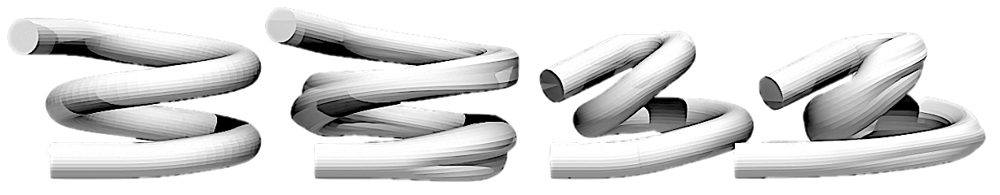

# Flow Reactor Optimisation and Discovery

[](https://github.com/psf/black) [](https://opensource.org/licenses/MIT)

<div align="center">
    
</div>

This repository contains a Dockerised application for a flow reactor design problem, suitable for use within **expensive, black-box, and multi-fidelity optimisation** tasks such as the optimisation and discovery of flow reactors.

The application provides two main ways to interact with the model:
1.  **Single Demo Run:** Execute a standalone script (`cross_section_demo.py`) inside the Docker container or locally to run a single CFD simulation with random parameters and observe the output directly.
2.  **API Endpoint:** Run a Flask web server (`reactor_design_problem/functions.py`) inside the Docker container. This exposes a REST API endpoint (`/cross_section`) that can be called repeatedly (e.g., by an optimisation algorithm) to evaluate different design parameters and fidelities.

## Basic Test (No Simulation)

To quickly test the setup without running a full simulation, you can use the `cross_section_demo.py` script. This script generates random design parameters and creates a corresponding reactor mesh using custom mesh generation code. 

To run the basic test first install the required dependencies in a python 3.10 virtual environment, it is highly recommended to use [uv](https://docs.astral.sh/uv/) to do this:

```bash
uv venv create --python=3.10 && \
uv .venv/bin/activate && \
uv pip install -r requirements.txt
```

Then execute the script:
```bash
python cross_section_demo.py
```

## Full Setup

1. **Install Docker:** Ensure you have Docker installed on your system. You can download it from [Docker's official website](https://www.docker.com/get-started). If you are on Windows, ensure you have WSL2 installed and Docker Desktop configured to use it.

2.  **Build the Docker image:** This step builds the common environment needed for both running methods. It will take approximately 10-15 minutes, depending on your system and network speed (due to installing dependencies and compiling swak4Foam).
    ```bash
    # For Intel/AMD processors:
    docker build -t benchmark .

    # For Apple Silicon (M1/M2/M3):
    docker build --platform linux/amd64 -t benchmark .

## Usage Method 1: Single Demo Run

This method runs the `cross_section_demo.py` script once within the Docker container. It's useful for testing the setup or understanding the basic simulation process.

1.  **Run the Docker container with an overridden command:**
    ```bash
    # The command needs to source the OpenFOAM env and activate the python venv first
    docker run benchmark bash -c "source /usr/lib/openfoam/openfoam2312/etc/bashrc && python cross_section_demo.py"
    ```
    This command tells Docker to run the `benchmark` image but execute the specified bash command instead of the default `flask run`.

2.  **Observe Output:** The script will print the randomly generated input dictionary (`s_dict`) and then run the CFD simulation. You should see log output from the mesh generation (`classy_blocks`) and the CFD run (`PyFoam`). The final objective value and cost (time) will be calculated and printed by `eval_cfd`.

## Usage Method 2: API Endpoint

This method runs the Flask application, making the benchmark accessible via network requests. It's designed for programmatic use, such as within an optimisation loop.

1.  **Run the Docker container (default command):**
    ```bash
    docker run -p 5001:5001 benchmark
    ```
    You should see output like `Starting Flask app...` followed by Flask server logs.

2.  **Send POST requests to the endpoint:** You can now send POST requests to `http://localhost:5001/cross_section` with your design parameters. Use a script like `reactor_design_problem/test_eval.py` or any HTTP client.

### API Notes

* **Inputs (`x`, `z`):** Both the 36 design variables (`x`) and the 2 fidelity parameters (`z`) are expected to be normalized between 0 and 1. The endpoint code (`reactor_design_problem/functions.py`) handles the un-normalisation based on predefined bounds.
* **Single vs. Multi-Fidelity:**
    * To perform multi-fidelity evaluations, include the `"z"` key in your JSON data with a list of two normalized fidelity values. The response will include both `"obj"` and `"cost"`.
    * To perform single-fidelity evaluations, *omit* the `"z"` key. The simulation will run with default fidelities (`[0.75, 0.75]`). The response will only include `"obj"`.
* **Fidelity Impact:** Lower fidelities generally evaluate faster but may result in simpler, potentially biased objective functions compared to higher fidelities.

## License

This project is licensed under the terms of the MIT license.